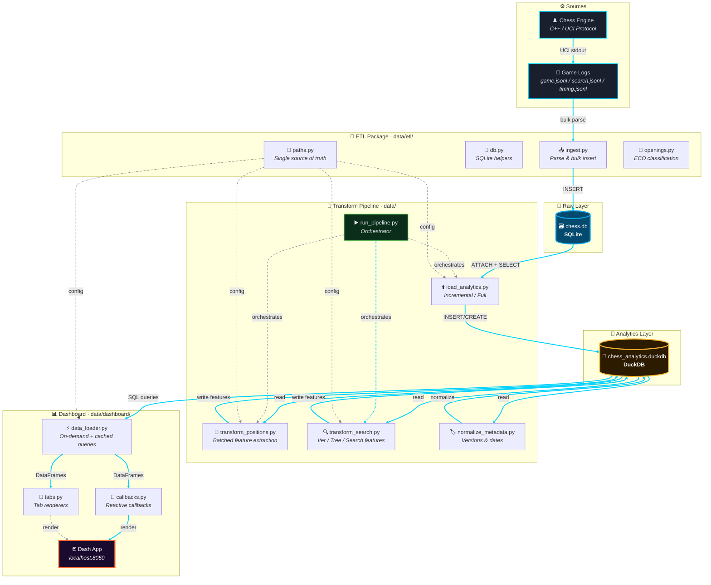

# Architecture

## Data Pipeline

```mermaid
graph TD
    subgraph Sources["⚙️ Sources"]
        ENG["♟️ Chess Engine<br/><i>C++ / UCI Protocol</i>"]
        LOGS["📄 Game Logs<br/><i>game.jsonl / search.jsonl / timing.jsonl</i>"]
    end

    subgraph ETL["🐍 ETL Package · data/etl/"]
        ING["📥 ingest.py<br/><i>Parse & bulk insert</i>"]
        DB["🔌 db.py<br/><i>SQLite helpers</i>"]
        PATHS["📍 paths.py<br/><i>Single source of truth</i>"]
        OPEN["📖 openings.py<br/><i>ECO classification</i>"]
    end

    subgraph Raw["💾 Raw Layer"]
        SQLITE[("🗃️ chess.db<br/><b>SQLite</b>")]
    end

    subgraph Transform["🔄 Transform Pipeline · data/"]
        LOAD["⬆️ load_analytics.py<br/><i>Incremental / Full</i>"]
        TP["🧩 transform_positions.py<br/><i>Batched feature extraction</i>"]
        TS["🔍 transform_search.py<br/><i>Iter / Tree / Search features</i>"]
        NM["🏷️ normalize_metadata.py<br/><i>Versions & dates</i>"]
        RUN["▶️ run_pipeline.py<br/><i>Orchestrator</i>"]
    end

    subgraph Analytics["🦆 Analytics Layer"]
        DUCK[("🦆 chess_analytics.duckdb<br/><b>DuckDB</b>")]
    end

    subgraph Dashboard["📊 Dashboard · data/dashboard/"]
        DL["⚡ data_loader.py<br/><i>On-demand + cached queries</i>"]
        CB["🔗 callbacks.py<br/><i>Reactive callbacks</i>"]
        TABS["📑 tabs.py<br/><i>Tab renderers</i>"]
        APP["🌐 Dash App<br/><i>localhost:8050</i>"]
    end

    ENG ==>|"UCI stdout"| LOGS
    LOGS ==>|"bulk parse"| ING
    ING ==>|"INSERT"| SQLITE
    SQLITE ==>|"ATTACH + SELECT"| LOAD
    LOAD ==>|"INSERT/CREATE"| DUCK
    DUCK ==>|"read"| TP
    DUCK ==>|"read"| TS
    DUCK ==>|"read"| NM
    TP ==>|"write features"| DUCK
    TS ==>|"write features"| DUCK
    NM ==>|"normalize"| DUCK
    RUN -.->|"orchestrates"| LOAD
    RUN -.->|"orchestrates"| TP
    RUN -.->|"orchestrates"| TS
    DUCK ==>|"SQL queries"| DL
    DL ==>|"DataFrames"| CB
    DL ==>|"DataFrames"| TABS
    CB ==>|"render"| APP
    TABS ==>|"render"| APP
    PATHS -.->|"config"| LOAD
    PATHS -.->|"config"| TP
    PATHS -.->|"config"| TS
    PATHS -.->|"config"| DL

    style ENG fill:#1a1f2e,stroke:#00d2ff,stroke-width:2px,color:#e8eaf0
    style LOGS fill:#1a1f2e,stroke:#00d2ff,stroke-width:2px,color:#e8eaf0
    style SQLITE fill:#044a6e,stroke:#0ea5e9,stroke-width:3px,color:#fff
    style DUCK fill:#2d1b00,stroke:#f7b731,stroke-width:3px,color:#fff
    style APP fill:#1a0a2e,stroke:#ff6b35,stroke-width:3px,color:#fff
    style RUN fill:#0a2e1a,stroke:#7fff6b,stroke-width:2px,color:#e8eaf0

    linkStyle 0,1,2,3,4,5,6,7,8,9,10,13,14,15,16,17 stroke:#00d2ff,stroke-width:2.5px
    linkStyle 11,12,18,19,20,21 stroke:#8892a4,stroke-width:1.5px,stroke-dasharray:5
```
