```mermaid
graph LR

subgraph INCR_ACC["Incremental Accumulation (every move)"]

    %% =========================
    %% INPUT
    %% =========================
    
    subgraph INPUT["Board State Representation"]
        BOARD["Board State"]
        FEAT["Chess768 Features \n12 pieces * 64 squares\nOne-Hot Encoding"]

        BOARD --> FEAT
    end

    %% =========================
    %% ACCUMULATOR (STATE, NOT LAYER)
    %% =========================
    subgraph ACC["Accumulators (Input Layer)"]

        STM["STM State<br/>int32[768]"]
        NTM["NTM State<br/>int32[768]"]

        L0S["Linear\n768 → 128<br/>L0 STM weights"]
        L0N["Linear\n768 → 128<br/>L0 NTM weights"]

        L0STM["STM Hidden 0 Pre-Activation\n(128)"]
        L0NTM["NTM Hidden 0 Pre-Activation\n(128)"]

    end

    FEAT -->|"incremental add/remove"| STM
    FEAT -->|"flipped-square update"| NTM

    STM --> |"weights added on\nincremental add/remove"| L0S 
    NTM --> |"weights added on\nincremental add/remove"| L0N 

end

    L0S --> L0STM --> A0S
    L0N --> L0NTM --> A0N

subgraph F_PASS["Forward Pass Evaluation (leaf nodes)"]

    %% =========================
    %% HIDDEN LAYER 0 (STM PATH)
    %% =========================
    subgraph H0S["Hidden Layer 0"]

        A0S["SCReLU<br/>clamp(0,255)²"]
        A0N["SCReLU<br/>clamp(0,255)²"]

        CAT["Concatenate<br/>128 + 128 = 256"]

    end

    A0S --> CAT
    A0N --> CAT

    L1["Linear\n256 → 1"]

    %% =========================
    %% OUTPUT HEAD
    %% =========================
    subgraph OUT["Output Head"]

        SCALE["Dequantize<br/>× 400 / (255 × 64)"]
        EVAL["Centipawn Eval"]

    end

end

CAT --> L1 --> SCALE --> EVAL

```

---
| Component | Value |
|----------|------|
| Input features | 768 |
| STM accumulator | 128 |
| NTM accumulator | 128 |
| Hidden layer (each branch) | 128 |
| Concatenated vector | 256 |
| Output | 1 |
| Weight type | int16 |
| Total parameters | 98.7k |
| Weight file size | ~197 KB |
| SCReLU clamp | 0–255 |
| Output scale | 400 |
| QB | 64 |
| QA | 255 |
---