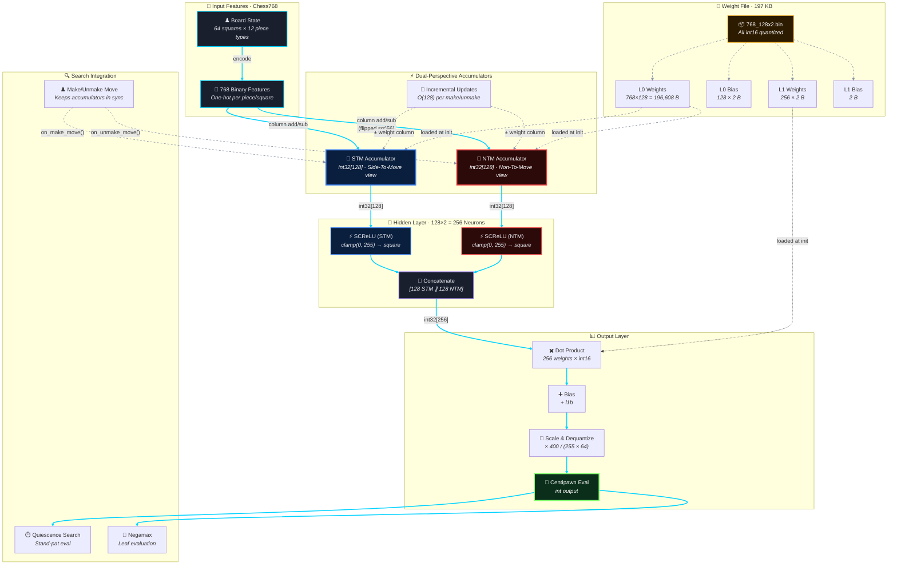

---

## NNUE Architecture · `768-128×2-1`

### Key Constants

| Parameter | Value | Purpose |
|-----------|-------|---------|
| `QA` | 255 | SCReLU clamp range |
| `QB` | 64 | Output dequantization divisor |
| `SCALE` | 400 | Centipawn scale factor |
| `HIDDEN_SIZE` | 128 | Neurons per perspective |
| **Total params** | 98,689 | (768×128 + 128 + 256 + 1) |
| **File size** | 197 KB | All int16 quantized |
